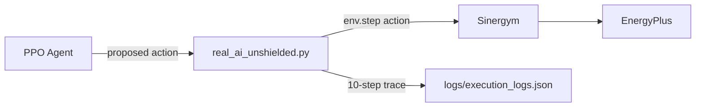
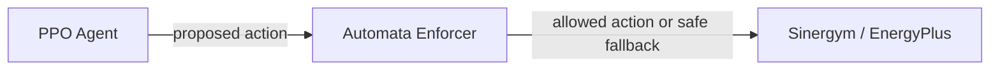

# SafeFlow AI

**A Formal Framework for Automata-Based AI Runtime Control**

Repository นี้เป็นพื้นที่เก็บ source code, เอกสาร และหลักฐานการทดลองของโครงงาน
SafeFlow AI โดยแยกออกจาก source code ของ Sinergym อย่างชัดเจน

> **สถานะปัจจุบัน:** มีเฉพาะการทดลองพื้นฐานแบบ **Unshielded Baseline**
> สำหรับเก็บพฤติกรรมของ PPO ก่อนมีเกราะความปลอดภัย ส่วน Automata Enforcer,
> safe fallback, policy parser และ environment wrapper **ยังไม่ได้ implement**

## SafeFlow AI คืออะไร

SafeFlow AI ศึกษาการวาง Automata Runtime Enforcer ระหว่าง AI agent กับ environment
เพื่อให้กฎความปลอดภัยมีสิทธิ์ตรวจสอบ action ก่อนส่งให้ `env.step()`

การทดลองที่มีอยู่ใน repository ตอนนี้ยังไม่ใช้ Enforcer และมีลำดับการทำงานดังนี้:



สถาปัตยกรรมที่งานวิจัยตั้งใจศึกษาในขั้นถัดไปคือ:



แผนภาพที่สองเป็นขอบเขตงานวิจัย ไม่ใช่ฟีเจอร์ที่มีอยู่แล้วใน branch ปัจจุบัน

## สิ่งที่รันได้ในปัจจุบัน

- Environment: `Eplus-5zone-hot-discrete-v1`
- Action space: `Discrete(10)` หรือ action ID 0 ถึง 9
- AI agent: Stable-Baselines3 PPO (`MlpPolicy`)
- จำนวน step ต่อการรัน: 10
- ผลลัพธ์: JSON execution trace
- Container runtime: Docker Desktop หรือ Docker Engine แบบ Linux container

ชุดที่ผ่านการทดสอบแล้ว:

- Sinergym `v3.12.2`
- Sinergym commit `4bb1b3f856af491f9b55f8a0d1b0baeaff44a6a0`
- Docker image ที่ build พร้อม `SINERGYM_EXTRAS="drl"`

## Quick start สำหรับ Windows PowerShell

### 1. เตรียมโปรแกรม

ต้องมี Git, Docker Desktop ที่เปิดใช้งาน Linux containers และพื้นที่ว่างสำหรับ
Docker image กับ EnergyPlus output

ตรวจว่า Docker Engine พร้อมใช้งาน:

```powershell
docker version
```

หาก PowerShell แจ้งว่าไม่พบคำสั่ง `docker` ให้ปิดและเปิด terminal ใหม่ก่อน
หรือเรียก Docker CLI จากตำแหน่งติดตั้งมาตรฐาน:

```powershell
& "$env:LOCALAPPDATA\Programs\DockerDesktop\resources\bin\docker.exe" version
```

### 2. Clone SafeFlow และ Sinergym

สร้าง workspace ใหม่ แล้ว clone สอง repository แยกจากกัน:

```powershell
mkdir safeflow-workspace
cd safeflow-workspace

git clone https://github.com/PavaritPramual/safeflow-automata.git safeflow-ai

mkdir external
git clone https://github.com/ugr-sail/sinergym.git external/sinergym
git -C external/sinergym checkout 4bb1b3f856af491f9b55f8a0d1b0baeaff44a6a0
```

หลัง clone จะได้โครงสร้าง:

```text
safeflow-workspace/
├── safeflow-ai/         Repository งานวิจัยของเรา
└── external/
    └── sinergym/        External simulator repository
```

### 3. Build Sinergym image พร้อม PPO dependency

รันจาก `safeflow-workspace/`:

```powershell
docker build --target runtime -t sinergym:latest --build-arg SINERGYM_EXTRAS="drl" .\external\sinergym
```

ห้ามใช้ image แบบ runtime minimal ที่ไม่ได้เปิด `drl` extra เพราะสคริปต์ต้อง import
`stable_baselines3`

ตรวจสอบ dependency ภายใน image:

```powershell
docker run --rm sinergym:latest python -c "import sinergym, stable_baselines3; print('Dependencies OK')"
```

ผลที่คาดหวัง:

```text
Dependencies OK
```

### 4. รัน Unshielded Baseline

เข้า repository SafeFlow ก่อนรันเสมอ เพราะ `${PWD}` จะถูก mount เป็น `/workspace`
ใน container:

```powershell
cd .\safeflow-ai

docker run --rm -v "${PWD}:/workspace" -w /workspace sinergym:latest python scripts/experiments/real_ai_unshielded.py
```

เมื่อสำเร็จจะเห็นข้อความ:

```text
[SUCCESS] Exported logs to logs/execution_logs.json successfully!
```

### 5. ตรวจผลลัพธ์

ตรวจว่าไฟล์ถูกสร้างและมี 10 records:

```powershell
Test-Path .\logs\execution_logs.json
(Get-Content .\logs\execution_logs.json -Raw | ConvertFrom-Json).Count
```

ผลที่คาดหวัง:

```text
True
10
```

เปิดดู JSON:

```powershell
notepad .\logs\execution_logs.json
```

Action trace อาจเปลี่ยนทุกครั้ง เพราะสคริปต์ใช้ `deterministic=False`

## ไฟล์ผลลัพธ์อยู่ที่ไหน

| ตำแหน่ง | ความหมาย | เก็บใน Git |
|---|---|---|
| `logs/execution_logs.json` | ผลจากการรันล่าสุด เขียนทับได้ | ไม่เก็บ |
| `experiments/unshielded-baseline/execution_logs.json` | หลักฐาน baseline ที่คัดเลือกแล้ว | เก็บ |
| `Eplus-*-res*/` | Working directory ที่ Sinergym/EnergyPlus สร้างทุกครั้ง | ไม่เก็บ |

`docker run --rm` ลบเฉพาะ container แต่ไฟล์ใน `/workspace` ยังคงอยู่บนเครื่อง
เนื่องจากเป็น bind mount โฟลเดอร์ `Eplus-*-res*/` จึงเพิ่มหมายเลขเป็น `res1`,
`res2`, `res3` ตามลำดับเพื่อไม่เขียนทับรอบก่อนหน้า สามารถลบได้หลังตรวจว่า
การจำลองสำเร็จแล้ว

## โครงสร้าง Repository

```text
configs/       ขอบเขตสำหรับ policy/config ในอนาคต; ยังไม่มี policy จริง
docker/        รายละเอียดการเตรียม Docker image
docs/          บริบทงานวิจัย สไลด์ และคู่มือ
experiments/   หลักฐานการทดลองที่คัดเลือกและต้องการ version control
logs/          Runtime output ชั่วคราว; Git ignore
scripts/       Experiment entrypoints ที่รันได้
src/           ขอบเขต implementation ของ SafeFlow ในอนาคต
tests/         ขอบเขตการทดสอบ component ของ SafeFlow ในอนาคต
```

Sinergym และ EnergyPlus เป็น external dependencies จึงต้องอยู่นอก repository นี้
และไม่ควรคัดลอก source code เข้ามาใน `safeflow-ai/`

## Baseline ที่เก็บเป็นหลักฐาน

หลักฐานเริ่มต้นอยู่ที่:

```text
experiments/unshielded-baseline/execution_logs.json
```

ไฟล์นี้เก็บ trace 10 steps:

```text
6 -> 7 -> 3 -> 1 -> 4 -> 9 -> 4 -> 0 -> 4 -> 3
```

คู่ `0 -> 4` ที่ step 8 และ 9 ถูกเก็บไว้เป็น short-cycling hazard candidate
สำหรับนำไปประเมินกับ policy ในขั้นถัดไป แต่ยังไม่ใช่ผลพิสูจน์จาก Automata Enforcer

## ปัญหาที่พบบ่อย

### `ModuleNotFoundError: No module named 'stable_baselines3'`

Docker image ถูก build โดยไม่มี `drl` extra ให้กลับไปทำขั้นตอนที่ 3 ใหม่

### `docker` is not recognized

ตรวจว่า Docker Desktop เปิดอยู่ เปิด PowerShell ใหม่ หรือใช้ Docker CLI path ที่ระบุในขั้นตอนที่ 1

### เกิด `Eplus-*-res*/` ใหม่ทุกรอบ

เป็นพฤติกรรมปกติของ Sinergym ไม่ใช่ error โฟลเดอร์เหล่านี้ถูก `.gitignore`
และลบได้หลังใช้งาน

### ไม่พบ `logs/execution_logs.json`

ตรวจว่ารันคำสั่งจาก root ของ `safeflow-ai` และดู error ก่อนบรรทัด `[SUCCESS]`

## เอกสารเพิ่มเติม

- [บริบทงานวิจัย](docs/research/project-context.md)
- [รายละเอียด Docker workflow](docker/README.md)
- [คำอธิบาย Unshielded baseline](experiments/unshielded-baseline/README.md)
