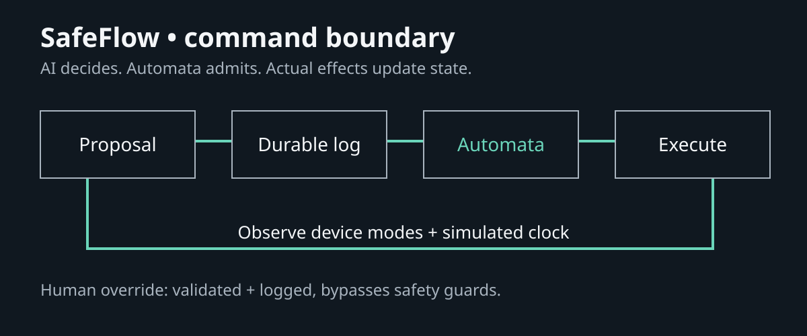

# SafeFlow AI

**A Formal Framework for Automata-Based AI Runtime Control**

SafeFlow places a policy automaton between an AI proposal and execution.
The case study is a simulated home: AC, heater, ventilation fan and light,
with a local LLM and Home Assistant. The environment permits conflicting modes;
the automaton decides which **AI commands** may proceed.

## Evidence first

| Evidence | Current result |
|---|---|
| Injected command sequence | 3 AI requests blocked in 15 rounds; blocked modes unchanged; replay passed |
| Human override | Both-on state permitted, logged, observed; AI resumes under guards |
| Automated tests | 33 passed, including real local HTTP fixture |
| Home Assistant | 17 entities loaded; goals, human queue and AI resumption checked via actual services |
| Qwen3-1.7B, revised prompt + tools | 40/40 valid, 10/40 expected actions — failed |
| Qwen3-1.7B, structured JSON | 36/40 valid, 5/40 expected actions — failed |
| UPPAAL | Model and queries prepared; verifier blocked by license — **not verified** |
| RAM 8 GB | Target only; current host has 32 GB — **not certified** |

[Read the traces and limitations](experiments/smart-home-stage2/README.md).
Injected proposals are test inputs, not discoveries about the real model.
Failed model gates remain evidence and do not stop independent Automata testing.

## How it works



1. A local model proposes one `set_device(device, mode)` or `hold()`.
2. SafeFlow records the raw response, proposal, source and state before execution.
3. Automata evaluates the proposal and durably records its decision.
4. Allowed commands execute. Blocked commands preserve device modes. Both advance simulated time by 30 seconds.
5. Actual results update the automaton and trace. Replay checks the recorded decisions and effects.

Human requests replace AI for one round, bypass safety guards, and remain validated
and logged. This means the whole house can reach a conflicting state; claims are
limited to the AI commands admitted by these guards.

## Two experimental rules

- AI cannot request AC cooling while the heater is on, or heater on while AC is cooling.
- After a real AC on-to-off transition, AI must wait **180 simulated seconds** before an off-to-on request.

Repeated off does not reset the clock. Human commands update the same clock.
A blocked request does not cause an automatic off command. Unknown input is
rejected; inconsistent observed state halts the episode. The 180-second value is
an experiment setting, not an appliance standard.

[State mapping, transitions and formal assumptions](docs/guides/automata.md)

## Run locally

Prerequisites: Python 3.11+, Ollama, Docker Desktop for Home Assistant.
From this repository:

```powershell
./scripts/setup-local.ps1 -Python python
ollama pull qwen3:1.7b
./.venv/Scripts/python.exe -m safeflow.server --model qwen3:1.7b --output-mode json --trace logs/home.jsonl
```

In another terminal:

```powershell
docker compose -f docker/compose.yaml up -d
```

Open Home Assistant at <http://localhost:8123>. Device toggles queue a human request;
**Run one round** executes it or asks AI. `--interval 5` enables automatic rounds;
`--unshielded` explicitly disables the policy for baseline experiments.
Structured JSON is an experimental transport, not a successful model-selection result.

[Setup, authentication, API, physics and shutdown](docs/guides/smart-home.md)

## Validate and reproduce

```powershell
./.venv/Scripts/python.exe -m unittest discover -s tests -v
./.venv/Scripts/python.exe scripts/run-stage2.py --output logs/injected-check
./.venv/Scripts/python.exe scripts/build-formal-model.py
```

Use an unused output directory: evidence is not overwritten. Model review uses
`--models` and two bounded configurations, without answer repair or oracle leakage.
The UPPAAL model requires a verifier license. No mathematical proof or full
runtime/model equivalence is claimed by the Python tests.

## Research boundaries

No training, paid API, physical devices or 3D scene. All room parameters are
synthetic; this prototype does not certify temperature, equipment or real-home
safety. Hardware acceptance on a friend's 8 GB machine remains pending.

Historical [Sinergym/PPO evidence](archive/sinergym/README.md) and
[stage-one results](experiments/smart-home-stage1/README.md) are retained.
Old action IDs do not establish compressor short-cycling.

Source lives in `src/safeflow`, public configuration in `configs`, curated evidence
in `experiments`, and ignored runtime output in `logs`. Tokens, model weights and
Home Assistant storage stay local.
