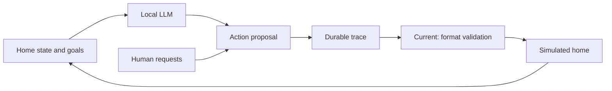

# SafeFlow AI

**A Formal Framework for Automata-Based AI Runtime Control**

SafeFlow studies an automata interception layer that checks proposed commands
before they affect an environment. The new case study is a simulated smart home,
a small local LLM, and Home Assistant for state display and human requests.
The framework is the research contribution; the model and home are the case study.

## Current status

The stage-one prototype runs: RC physics, durable pre-execution JSONL, local Ollama
proposals, and real Home Assistant entities/services. **It is unshielded.**

The real model gate on 2026-10-06 failed: Qwen3-0.6B returned 0/40 valid commands;
Qwen3-1.7B returned 40/40 valid commands but only 20/40 expected actions (32 required).
Development pauses before Automata enforcement/UPPAAL until model selection is
reviewed. Neither autonomous-control readiness nor 8 GB compatibility is claimed.

See [recorded results and raw traces](experiments/smart-home-stage1/README.md).


```mermaid
flowchart LR
    S[Home state and goals] --> A[Local LLM]
    A --> P[Action proposal]
    H[Human requests] --> P
    P --> L[Durable trace]
    L --> V[Current: format validation]
    V --> B[Simulated home]
    B --> S
```

The planned Automata Enforcer will sit after logging and before execution.
Format validation currently rejects malformed commands, not unsafe combinations.

## Run the prototype

Follow the [Windows setup, API and test guide](docs/guides/smart-home.md).

```powershell
./scripts/setup-local.ps1 -Python python
ollama pull qwen3:0.6b
./.venv/Scripts/python.exe -m safeflow.server --trace logs/model-06b.jsonl
```

In a second terminal:

```powershell
docker compose -f docker/compose.yaml up -d
./.venv/Scripts/python.exe -m safeflow.evaluate --output logs/gate-06b.json
```

Open Home Assistant at <http://localhost:8123>. The guide describes the 1.7B fallback,
automatic-round option, human controls, local credentials and shutdown.

## Implemented first-stage boundaries

- Ollama `qwen3:0.6b`; try `qwen3:1.7b` if the first model fails the gate.
- One room: air conditioner, heater, ventilation fan and light.
- RC thermal physics and device power; 30 simulation seconds per round.
- One `set_device(device, mode)` or `hold()` proposal per response.
- Human goals and direct requests; direct requests replace AI for one round.
- Invalid proposals never execute. Input validation is not a safety shield.
- Low-memory target, no paid API, no training.

The friend's **8 GB RAM limit** remains an acceptance check. Recorded execution
used a 32 GB host, with Docker/WSL limitations recorded explicitly.

## Historical experiment

The Sinergym/PPO experiment remains in
[experiments/legacy-sinergym](experiments/legacy-sinergym/README.md).
Its ten-step trace is historical logging evidence, not proof of an equipment
hazard or a working enforcer. The external Sinergym checkout remains untouched.

## Repository boundaries

`src/safeflow` separates simulation, agent, logging and control.
`configs` holds public settings, `docker` holds Home Assistant setup,
`experiments` holds curated evidence, and `logs` holds ignored runtime output.

Proposal documents and the infographic are outside this change. Development
happens on a draft pull request; `main` is unchanged.
