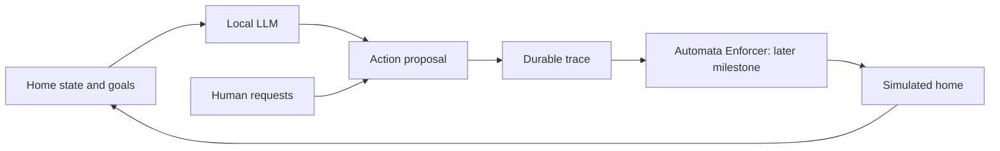

# SafeFlow AI

**A Formal Framework for Automata-Based AI Runtime Control**

SafeFlow studies an automata interception layer that checks proposed commands
before they affect an environment. The new case study is a simulated smart home,
a small local LLM, and Home Assistant for state display and human requests.
The framework is the research contribution; the model and home are the case study.

## Current status

This branch prepares a new prototype. No smart-home execution results or working
safety enforcer are claimed yet. The first milestone is real model proposals,
pre-execution JSONL logging, deterministic physics and Home Assistant integration.
Safety enforcement and offline UPPAAL checks follow that acceptance gate.

```mermaid
flowchart LR
    S[Home state and goals] --> A[Local LLM]
    A --> P[Action proposal]
    H[Human requests] --> P
    P --> L[Durable trace]
    L --> E[Automata Enforcer: later milestone]
    E --> B[Simulated home]
    B --> S
```

## Planned first milestone

- Ollama `qwen3:0.6b`; try `qwen3:1.7b` if the first model fails the gate.
- One room: air conditioner, heater, ventilation fan and light.
- RC thermal physics and device power; 30 simulation seconds per round.
- One `set_device(device, mode)` or `hold()` proposal per response.
- Human goals and direct requests; direct requests replace AI for one round.
- Invalid proposals never execute. Input validation is not a safety shield.
- Low-memory target, no paid API, no training.

## Historical experiment

The Sinergym/PPO experiment remains in
[experiments/legacy-sinergym](experiments/legacy-sinergym/README.md).
Its ten-step trace is historical logging evidence, not proof of an equipment
hazard or a working enforcer. The external Sinergym checkout remains untouched.

## Repository boundaries

`src/safeflow` separates simulation, agent, logging and control.
`configs` holds public settings, `docker` holds Home Assistant setup,
`experiments` holds curated evidence, and `logs` holds ignored runtime output.

Proposal documents and the infographic are outside this change. Development
happens on a draft pull request; `main` is unchanged.
